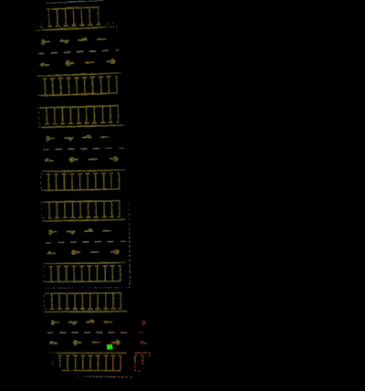
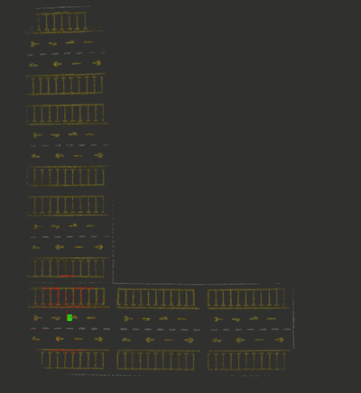
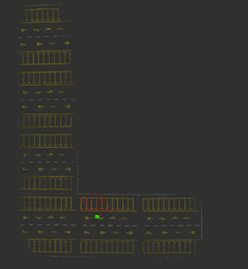
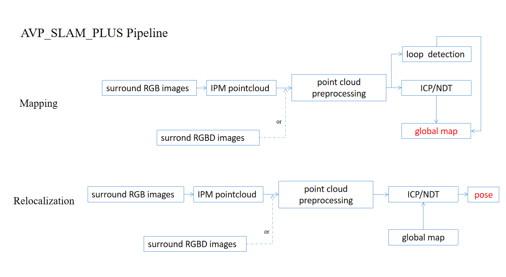

# AVP-SLAM-PLUS
AVP-SLAM-PLUS is an implementation of AVP_SLAM and some new contributions. Performance of AVP-SLAM-PLUS could be found in video(https://www.bilibili.com/video/BV11R4y137xb/)

<p align='center'>


<h5 align="center">mapping</h5>
</p>

<p align='center'>


<h5 align="center">localization</h5>
</p>
                  
AVP-SLAM-PLUS contain a simple implementation of [AVP-SLAM: Semantic Visual Mapping and Localization for Autonomous Vehicles in the Parking Lot(IROS 2020)](https://arxiv.org/abs/2007.01813) and some new contributions.

The new contribustions are as follows: Firstly,the system provide two camera style mode which are multi RGB cameras mode and multi RGBD cameras mode; Secondly,the system provide two registration mode which are ICP mode and NDT mode. Lastly,the system provide mapping mode and localization mode, that means you can not only do SLAM,but also do localization in a prior map.

<p align='center'>

<h5 align="center">AVP_SLAM_PLUS Framework</h5>
</p>

This code is simple and is a good learning material for SLAM beginners.


**Author**: Liu Guitao

**Email**: liuguitao@sia.cn

## 1. Prerequisites
### 1.1 **Ubuntu** and **ROS**
Ubuntu 64-bit 18.04.ROS Melodic. [ROS Installation](http://wiki.ros.org/ROS/Installation)

### 1.2 **Clone AVP-SLAM-PLUS** and **Load Gazebo Model** 
```
    cd ~/catkin_ws/src
    git clone https://github.com/liuguitao/AVP-SLAM-PLUS.git
    cd AVP-SLAM-PLUS/avp_slam_plus/model/
    unzip my_ground_plane.zip -d ~/.gazebo/models/
```

## 2. Build AVP-SLAM-PLUS

```
    cd ~/catkin_ws
    catkin_make
    source ~/catkin_ws/devel/setup.bash
```
## 3. RUN Example
### 3.1  **RGB Mode**
                  
#### **save map**

if you want to save map and use the map to do localization, you should ensure your config file have be correctely set. The config file is at   **AVP-SLAM-PLUS/avp_slam_plus/configFile.yaml**

```
    mapSave: true
    mapSaveLocation: your map file address 
```                 
                  
#### 3.1.1  **Mapping**
```
    roslaunch avp_slam_plus slamRGB.launch
```

open a new terminal, control robot move. 
```
    roslaunch robot_control robot_control.launch
```
if you firstly control robot move, you should ensure **robot_control.py** in **AVP-SLAM-PLUS/simlate_gazebo/robot_control/** to be executable. you can do this command to let **robot_control.py** to be executable.
```
    chmod +777 robot_control.py
```                 

#### 3.1.2  **Localization**
if you have do 3.1.1 "save map", you can do localization in the prior map.
```
    roslaunch avp_slam_plus localizaitonRGB.launch
```


open a new terminal, control robot move
```
    roslaunch robot_control robot_control.launch
```

### 3.2  **RGBD Mode**
 
#### **save map**

if you want to save map and use the map to do localization, you should ensure your config file have be correctely set. The config file is at   **AVP-SLAM-PLUS-main/avp_slam_plus/configFile.yaml**
                               
                               
#### 3.2.1  **Mapping**
```
    roslaunch avp_slam_plus slamRGBD.launch
```

open a new terminal, control robot move
```
    roslaunch robot_control robot_control.launch
```


#### 3.2.2  **Localization**

```
    roslaunch avp_slam_plus localizaitonRGBD.launch
```

open a new terminal, control robot move
```
    roslaunch robot_control robot_control.launch
```

## 4.Acknowledgements
Thanks for AVP_SLAM(Tong Qin, Tongqing Chen, Yilun Chen, and Qing Su:Semantic Visual Mapping and Localization for Autonomous Vehicles in the Parking Lot),

Thanks for TurtleZhong(https://github.com/TurtleZhong/AVP-SLAM-SIM), whose simulated environment help me a lot.

Thanks for huchunxu(https://github.com/huchunxu/ros_exploring), whose simulated robot model help me a lot.
